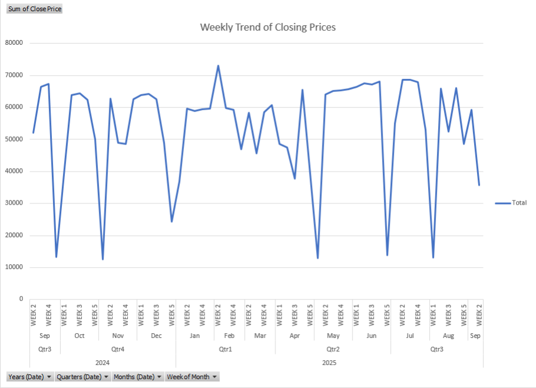
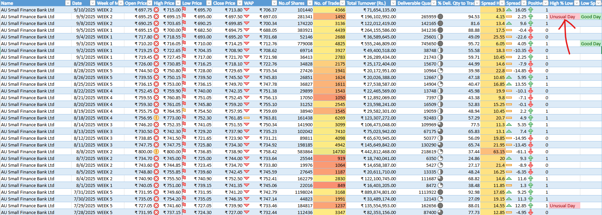
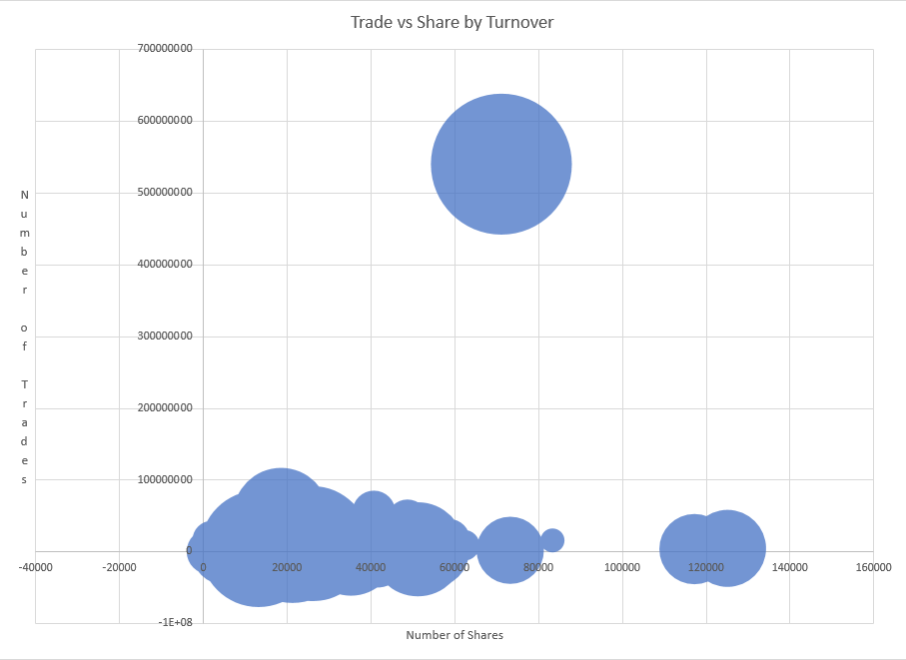
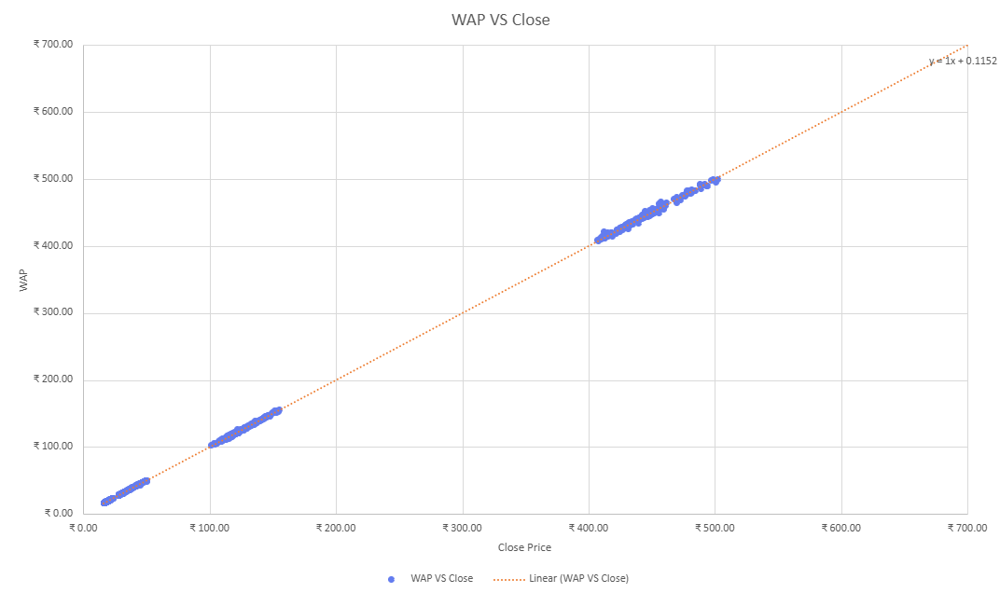

# Stock Market Analysis of Indian Banks

## Project Overview

This project presents a comprehensive analysis of the stock market performance of various Indian banks. The dataset, collected from the Bombay Stock Exchange (BSE), spans a one-year period, with the data captured on September 10, 2025. The primary focus of this analysis is to derive actionable insights from historical stock market data, categorized under the Equity T+1 segment. This README provides a detailed overview of the project, including the dataset, the analysis performed, key findings, and an in-depth explanation of the T+1 settlement cycle prevalent in the Indian stock market.

The analysis is structured into three levels of complexity: Easy, Intermediate, and Advanced. This tiered approach allows for a gradual understanding of the dataset, starting from basic descriptive insights and moving towards more complex trend and correlation analysis, and finally, predictive and strategic insights. The ultimate goal is to provide a holistic view of the Indian banking sector's performance on the stock market and to equip stakeholders with valuable information for decision-making.

## Understanding the T+1 Settlement Cycle

A crucial aspect of this analysis is its foundation on data from the T+1 settlement segment. The Indian stock market has notably transitioned to a T+1 settlement cycle, a move that has significant implications for investors and the market ecosystem.

### What is T+1 Settlement?

The T+1 (Trade Date plus one day) settlement cycle means that all trades executed on a particular day (T) are settled on the very next business day (T+1). This is a significant shift from the earlier T+2 system, where settlements took two business days. For instance, if an investor buys shares on a Monday, the shares will be credited to their Demat account, and the funds will be debited from their bank account by Tuesday. This expedited process excludes Saturdays, Sundays, and any bank or exchange holidays.

India has been a pioneer in shortening the settlement cycle, having moved from T+5 to T+3 in 2002, and then to T+2 in 2003. The transition to the T+1 cycle was implemented in a phased manner, starting in February 2022 and concluding in January 2023, making all Indian equity and fixed-income securities listed on the BSE and NSE settle on a T+1 basis.

### Key Features of T+1 Settlement on BSE

*   **Effective Date:** All equity and fixed-income securities have been settling on a T+1 basis since January 27, 2023.
*   **Demat Mode Only:** All settlements are mandatorily done in a dematerialized (electronic) form.
*   **Net and Gross Basis Settlement:** For most securities, the buy and sell positions of a broker in the same security are netted, and only the net quantity or value is settled. However, for certain securities, such as those under the "T" group or trade-to-trade surveillance, settlement is done on a gross basis, without any netting.

### Timeline of Settlement Activities

*   **T Day (Trading Day):**
    *   Trading occurs on the stock exchange.
    *   Brokers download provisional obligation statements.
*   **T+1 Day (Settlement Day):**
    *   Final obligation statements are available for download by 9:30 AM.
    *   Pay-in of funds and securities is completed by 11:00 AM.
    *   Pay-out of funds and securities is completed by 1:30 PM.
    *   An auction is conducted at 2:00 PM if needed (in case of short delivery).

### Implications for Investors

The move to a T+1 settlement cycle has several key benefits for investors:

*   **Faster Access to Funds and Securities:** Investors receive their securities or funds a day earlier, which improves liquidity and allows for quicker reinvestment.
*   **Reduced Counterparty Risk:** The shorter settlement period reduces the risk of the counterparty defaulting on the trade.
*   **Increased Market Efficiency:** The faster turnaround of funds and securities contributes to a more efficient and dynamic market.

## Dataset Description

The analysis is based on a dataset collected from the official BSE India website: [https://www.bseindia.com/markets/equity/EQReports/StockPrcHistori.html?flag=0](https://www.bseindia.com/markets/equity/EQReports/StockPrcHistori.html?flag=0). The dataset encompasses one year of historical stock market data for various Indian banks, captured on September 10, 2025.
Collected data shown in `Data Collected` folder [View Folder](Data_Collected)

## Live Report from Sharepoint

Link- [View the Live Report](https://shaktiwork-my.sharepoint.com/:x:/g/personal/admin_shakti_work/EVNrRjbtC8xBiyQxqAXfNj4B8K7e3dnglIBSgU6C_94IpA?e=QxB13l)

---

## Data Collection and Preparation

To ensure our analysis is accurate and reliable, we followed a careful process to collect and prepare the data. Think of it as gathering and organizing all the necessary puzzle pieces before putting them together to see the big picture.

**1. Gathering the Raw Data**

First, we collected individual data files for various Indian banks. Each file contained daily stock market information for a specific bank. All these files were stored in a central folder on our system.

**2. Combining All Files into One Master Sheet**

Instead of analyzing each file one by one, we used a tool to automatically open every file in our folder, take out the relevant stock market data, and combine it all into a single, comprehensive master dataset. This step brought all the information from different banks into one place, making it much easier to analyze as a whole.

**3. Cleaning and Organizing the Data**

The raw data, like any initial collection of information, needed some tidying up. Our process involved a few key steps:

*   **Removing Clutter:** We started by getting rid of extra system-generated information about the files, such as file creation dates and folder paths, which weren't needed for the analysis.
*   **Structuring the Information:** We then organized the combined data into a clean table with clear columns for each piece of information, such as the trading date, opening price, closing price, and number of shares traded.

**4. Making the Data Usable**

Once organized, we made sure the data in each column was in the correct format. This is a crucial step to prevent errors in our calculations. For example:

*   We made sure all dates were recognized as actual dates.
*   We converted all price and volume figures into numerical formats so we could perform mathematical calculations on them.
*   We specifically formatted the "Total Turnover" column as Indian Rupees (₹) to ensure it was correctly interpreted as currency.

**5. Final Polishing**

As a final touch, we cleaned up the names of the banks, which were originally taken from the file names (e.g., "BankName.csv"). We removed the file extension part (like ".csv") to leave just the clean, readable bank names.

By the end of this process, we had a single, clean, and well-structured dataset. This solid foundation of high-quality data was essential for conducting the detailed analysis and drawing the meaningful insights shared in this report.

### Column Information

The dataset includes the following columns, providing a rich source of information for in-depth analysis:

| Column Name | Description |
| :--- | :--- |
| **Date** | The trading date for the equity. |
| **Open Price** | The price at which the stock first traded when the market opened. |
| **High Price** | The highest price the stock reached during the trading session. |
| **Low Price** | The lowest price the stock reached during the trading session. |
| **Close Price** | The final price at which the stock traded before the market closed. |
| **WAP (Weighted Average Price)** | The average price of the stock during the day, weighted by volume. |
| **No. of Shares** | The total number of shares traded during the day. |
| **No. of Trades** | The total number of individual trades executed. |
| **Total Turnover (Rs.)** | The total value of shares traded, in Indian Rupees. |
| **Deliverable Quantity** | The number of shares that were actually delivered to investors' Demat accounts. |
| **% Deli. Qty to Traded Qty** | The percentage of traded shares that resulted in delivery. |
| **Spread High-Low** | The difference between the highest and lowest price of the day. |
| **Spread Close-Open** | The difference between the closing and opening price of the day. |

## Analysis Performed

The analysis was conducted in three stages, each with increasing complexity, to uncover a wide range of insights from the dataset.

### 🟢 Easy-Level Questions (Basic Descriptive Insights)

This initial phase focused on understanding the fundamental characteristics of the data and establishing key metrics. The questions addressed include:

*   What is the average closing price over the period?
*   Which day had the highest closing price?
*   What is the average daily trading volume (No. of Shares)?
*   Which day had the highest turnover in ₹?
*   What is the average delivery percentage across all days?
*   How many days had a positive price movement (Close > Open)?
*   What is the average spread between high and low prices?

### 🟡 Intermediate-Level Questions (Trend & Correlation Analysis)

This stage delved deeper into the data to explore relationships and patterns between different variables. The analysis sought to answer questions such as:

*   Is there a correlation between trading volume and price volatility (Spread High-Low)?
*   Does a higher delivery percentage correlate with positive price movement?
*   What is the trend in closing prices over the week?
*   Are there any days with unusually high delivery percentage and a low number of trades?
*   Which day had the highest WAP and how did it compare to the closing price?
*   How does the number of trades relate to turnover and volume?

### 🔴 Advanced-Level Questions (Predictive & Strategic Insights)

The final and most complex stage of the analysis involved exploring predictive modeling and strategic implications based on the data. The questions in this category included:

*   Can we predict the next day’s closing price using WAP and volume trends?
*   What is the volatility index for the stock over the period?
*   What is the relationship between closing prices and Weighted Average prices?
*   Which days show signs of institutional accumulation (high delivery percentage, low trades)?

## Key Findings

The comprehensive analysis of the Indian banking sector's stock market data yielded several key findings:

*   **Average Closing Price Over Period:** ₹351.7275197
*   **Day with the Highest Closing price:** 22-Apr-2025
*   **Bank with the Highest Closing Price:** Kotak Mahindra Bank Ltd
*   **Average Number of Shares Traded Daily:** 851,931.6313
*   **Highest Total Turnover in a Single Day:** ₹11,645,233,705.00
*   **Day with the Highest Turnover:** 03-Jun-2025
*   **Bank with the Highest Total Turnover:** Yes Bank Ltd
*   **Average Delivery Percentage Across All Days:** 48.04605537%
*   **Number of Days with Positive Price Movement:** 3,942
*   **Average Spread between High and Low Price:** 7.93135904
*   **Days with High Delivery Percentage and Low Number of Trades:** 414
*   **Day with the Highest WAP:** 22-Apr-2025
*   **Closing Price on the Day with the Highest WAP:** ₹2267.55
*   **Correlation between Trading Volume and Price Volatility:** -0.051394382
*   **Correlation between Higher Delivery % and +VE Price Movement:** -0.080952718

### Findings With Charts

*   **Trend in closing Prices over the Week:**

*   **days with unusually high delivery % and low number of trades:**

*   **Number of Trades relate to Turnover and Volume:**

*   **WAP vs Number of Shares:**

*   **Volatility Index Analysis:**

*   **relationship between closing prices and Weighted Average prices:**

These findings provide a snapshot of the performance and trading characteristics of the Indian banking stocks over the analyzed period. The high turnover of Yes Bank, for instance, suggests significant investor interest and trading activity, while the high closing price of Kotak Mahindra Bank indicates strong market valuation. The significant number of days with positive price movement points towards a generally bullish trend in the banking sector during this period. The identification of days with high delivery percentage and low trades could be indicative of strategic buying by institutional investors, a valuable insight for retail investors.

## Conclusion

This project provides a multi-faceted analysis of the Indian banking sector's stock market performance. By leveraging a comprehensive dataset and a structured analytical approach, we have been able to extract valuable insights ranging from basic descriptive statistics to more complex trend and predictive analysis. The exploration of the T+1 settlement cycle provides essential context for understanding the dynamics of the Indian stock market. The findings from this analysis can serve as a valuable resource for investors, financial analysts, and anyone interested in the Indian financial markets. Further research could involve expanding the dataset to include more banks, a longer time frame, and incorporating fundamental analysis alongside the technical analysis performed here.